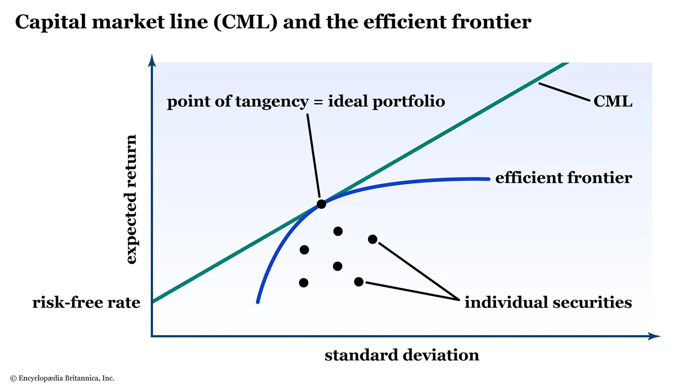
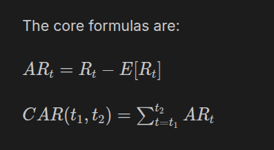

**NoteBooks Details** 

# All the Above notebook are related to financial instruments research 
# Most of the research have been done on Indian Share market, Commodities Market, And individual regional markets 

- research_1.ipynb is related to individual stocks and Portfolio theory stated by Harry Markowitz Law in 1952 
    - It calculates the expected return (mean) and risk (standard deviation) of each stock, plots them on a Cartesian plane, and calculates their correlations to find the most efficient combinations of those stocks."
    

### research_2.ipynb Stock Price Forecasting Using Machine Learning
==============================================

This project builds a multi-model machine learning pipeline for forecasting stock prices of major Indian companies using historical market data, technical indicators, and ensemble learning techniques.

* * * * *

Objective
---------

The main objectives of this project are:

-   Predict short-term stock prices for Indian equities.
-   Compare traditional linear models with gradient boosting methods.
-   Generate recursive multi-day forecasts for multiple stocks.
-   Evaluate model robustness using walk-forward validation.
-   Identify the most influential technical indicators affecting predictions.

* * * * *

Dataset
-------

Historical stock market data was downloaded using the `yfinance` Python library.

### Stocks Included

-   RELIANCE.NS
-   TCS.NS
-   HDFCBANK.NS
-   INFY.NS
-   ICICIBANK.NS
-   HINDUNILVR.NS
-   ITC.NS
-   SBIN.NS
-   ASHOKLEY.NS

### Data Summary

-   Raw dataset shape: **11,142 rows × 6 columns**
-   Feature engineered dataset: **9,342 rows × 42 features**
-   Training set: **8,397 rows**
-   Test set: **936 rows**

### Features Used

The project generated multiple technical indicators and lag-based features, including:

-   Moving averages (SMA, EMA)
-   Bollinger Bands
-   Lagged price features
-   Volatility measures
-   Trend indicators

* * * * *

Methodology
-----------

### 1\. Data Collection

Historical OHLC stock data was collected using:

-   Open
-   High
-   Low
-   Adjusted Close prices

* * * * *

### 2\. Feature Engineering

Technical indicators and lag variables were created to capture:

-   Momentum
-   Trend
-   Volatility
-   Mean reversion behavior

Examples:

-   SMA_50
-   EMA_200
-   Bollinger Bands
-   Lagged High/Low values

* * * * *

### 3\. Machine Learning Models

The following models were trained and compared:

#### Ridge Regression

Linear regression with L2 regularization.

#### Lasso Regression

Linear regression with L1 regularization and feature selection.

#### LightGBM

Gradient boosting framework optimized for high-performance tree-based learning.

#### Ensemble Model

Weighted combination of multiple models for improved forecasting stability.

* * * * *

### 4\. Validation Strategy

Walk-forward validation with 5 folds was used to simulate real-world forecasting conditions.

This approach:

-   Preserves time-series order
-   Prevents data leakage
-   Tests model adaptability over time

* * * * *

Results
-------

Test Set Performance
--------------------

| Model | MAE | RMSE | MAPE | R² |
| --- | --- | --- | --- | --- |
| Ridge | 23.79 | 36.78 | 1.99% | High |
| Lasso | Best overall | Strong stability | Low error | Excellent |
| LightGBM | Highly variable | Overfitting observed | Unstable in some folds | Weak consistency |
| Ensemble | RMSE = 36.45 | Balanced performance | Improved forecasting | Strong |

* * * * *

Walk-Forward Validation Results
-------------------------------

### Average Across 5 Folds

| Model | MAE | RMSE | MAPE | R² |
| --- | --- | --- | --- | --- |
| Ridge | 17.82 | 26.71 | 1.94% | 0.9954 |
| Lasso | **17.03** | **26.08** | **1.68%** | **0.9958** |
| LightGBM | 105.22 | 128.20 | 33.20% | 0.4239 |
| Ensemble | 43.00 | 52.44 | 11.85% | 0.9294 |

* * * * *

Key Findings
------------

-   Lasso Regression achieved the most stable and accurate overall performance.
-   Ridge Regression also performed strongly with very high R² scores.
-   LightGBM showed instability and overfitting in certain folds.
-   Ensemble forecasting improved robustness but inherited some instability from LightGBM.
-   Technical indicators such as:
    -   SMA_50
    -   EMA_200
    -   Bollinger Bands
    -   Lagged High values\
        were among the most important predictive features.

* * * * *

Forecasting Output
------------------

The project generated recursive 5-day forecasts for each stock.

Example:

### RELIANCE.NS

-   2026-05-22 → 1356.78
-   2026-05-25 → 1359.03
-   2026-05-26 → 1357.56

### ASHOKLEY.NS

-   2026-05-22 → 158.84
-   2026-05-25 → 162.01
-   2026-05-26 → 164.08

* * * * *

Technologies Used
-----------------

-   Python
-   Pandas
-   NumPy
-   Scikit-learn
-   LightGBM
-   yFinance
-   Matplotlib

* * * * *

Future Improvements
-------------------

Possible extensions include:

-   LSTM and Transformer-based deep learning models
-   Sentiment analysis integration
-   Macroeconomic indicators
-   Real-time streaming prediction systems
-   Hyperparameter optimization using Bayesian tuning
    
### research_3.ipynb Quantitative Analysis of Maritime Defense Companies Around Chokepoint Disruptions
=================================================================================

This project performs a quantitative event study on global maritime defense and shipbuilding companies to analyze how geopolitical chokepoint disruptions impact stock market performance and financial stability. The analysis combines abnormal return modeling with corporate financial health metrics and correlation analysis.

Objective
---------

The main objectives of this study are:

-   Analyze the market reaction of defense and maritime companies during major geopolitical maritime disruptions.
-   Measure abnormal stock returns around key global chokepoint events such as:
    -   Red Sea attacks
    -   Suez Canal blockage
    -   Hormuz tanker escalations
    -   Tanker War
-   Compare company behavior across different regions:
    -   United States
    -   United Kingdom
    -   Japan
    -   India
-   Evaluate financial stability using:
    -   Sharpe Ratio
    -   Annualized Volatility
    -   Beneish M-Score
    -   Altman Z-Score
-   Identify abnormal financial ratio outliers using z-score detection.
-   Study inter-company behavioral similarity through event-wise CAR correlation heatmaps.

* * * * *

Dataset & Companies
-------------------

The project uses historical stock market data retrieved using the Python library `yfinance`.

### Companies Analyzed

-   Lockheed Martin
-   RTX Corporation
-   General Dynamics
-   Northrop Grumman
-   BAE Systems
-   Rolls-Royce Holdings
-   Thales Group
-   Mitsubishi Heavy Industries
-   Kawasaki Heavy Industries
-   Mitsubishi Electric
-   Garden Reach Shipbuilders & Engineers
-   Mazagon Dock Shipbuilders
-   Cochin Shipyard

### Benchmarks Used

-   S&P 500
-   FTSE Index
-   Nikkei 225
-   NIFTY 50

### Major Events Studied

-   Strait of Hormuz Blockade (hypothetical)
-   Red Sea Houthi attacks
-   Ever Given Suez blockage
-   Hormuz tanker attacks
-   Maersk Tigris seizure
-   Iran-Iraq Tanker War
-   Six-Day War / Suez closure

* * * * *

Methodology
-----------

### 1\. Event Study Analysis

The project computes:

-   Daily stock returns
-   Benchmark returns
-   Abnormal Returns (AR)

The abnormal return is calculated as:

ARt=Rt-Rm,tAR_t = R_t - R_{m,t}ARt​=Rt​-Rm,t​

Where:

-   RtR_tRt​ = company return
-   Rm,tR_{m,t}Rm,t​ = benchmark market return

Cumulative Abnormal Returns (CAR) are then calculated over a ±30 day event window.

* * * * *

### 2\. Risk & Performance Metrics

#### Sharpe Ratio

Used to evaluate risk-adjusted returns.

Sharpe=Rp-RfσpSharpe = \frac{R_p - R_f}{\sigma_p}Sharpe=σp​Rp​-Rf​​

#### Annualized Volatility

Measures the dispersion of returns and market uncertainty.

* * * * *

### 3\. Financial Health Analysis

#### Beneish M-Score

Used to detect potential earnings manipulation risk.

#### Altman Z-Score

Used to estimate bankruptcy or financial distress probability.

* * * * *

### 4\. Outlier Detection

Financial ratios such as:

-   Current Ratio
-   Debt/Equity
-   ROE
-   Net Margin
-   Debt/Assets

were analyzed using z-score methods to identify extreme financial behavior.

* * * * *

### 5\. Correlation Analysis

For each geopolitical event:

-   CAR time series were compared across companies.
-   Pairwise correlation matrices were generated.
-   Heatmaps were used to visualize similarities in market reactions.

* * * * *

Results & Findings
------------------

### Key Observations

-   Defense companies generally showed positive abnormal returns during geopolitical disruptions.
-   Indian shipbuilding companies demonstrated particularly strong CAR responses during maritime conflict periods.
-   Companies with stronger balance sheets and higher Altman Z-Scores tended to exhibit lower volatility.
-   Correlation heatmaps showed strong clustering among companies from similar regions and sectors.
-   No major extreme financial outliers were detected in most firms.
-   Several historical events were skipped due to insufficient market data availability for certain companies.

### Financial Interpretation

-   Higher Sharpe Ratio → better risk-adjusted performance
-   Lower volatility → more stable returns
-   Beneish M-Score below -2.22 → lower manipulation risk
-   Higher Altman Z-Score → stronger financial health

* * * * *

Technologies Used
-----------------

-   Python
-   Pandas
-   NumPy
-   yFinance
-   Matplotlib
-   Seaborn
-   SciPy

* * * * *

Future Improvements
-------------------

Possible extensions of this project include:

-   Machine learning prediction models for defense stock reactions
-   Real-time geopolitical event monitoring
-   Sentiment analysis from news feeds
-   Portfolio optimization during geopolitical crises
-   Dynamic factor modeling with macroeconomic variables